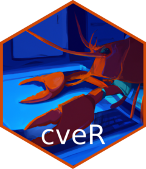

<!-- README.md is generated from README.Rmd. Please edit that file -->

```{r, include = FALSE}
knitr::opts_chunk$set(
  collapse = TRUE,
  comment = "#>",
  fig.path = "man/figures/README-",
  out.width = "100%"
)
```

# cveR 

<!-- badges: start -->
[](https://app.codecov.io/gh/Cdk29/cveR?branch=main)
[](https://github.com/Cdk29/cveR/actions/workflows/R-CMD-check.yaml)
<!-- badges: end -->

The goal of cveR is monitor the publication of new CVEs.

## Installation

You can install the development version of cveR from [GitHub](https://github.com/) with:

``` r
# install.packages("devtools")
devtools::install_github("Cdk29/cveR")
```

## Example

This is a basic example which shows you how to solve a common problem:

```{r example}
# library(cveR)
## basic example code
```


You'll still need to render `README.Rmd` regularly, to keep `README.md` up-to-date. `devtools::build_readme()` is handy for this. You could also use GitHub Actions to re-render `README.Rmd` every time you push. An example workflow can be found here: <https://github.com/r-lib/actions/tree/v1/examples>.
